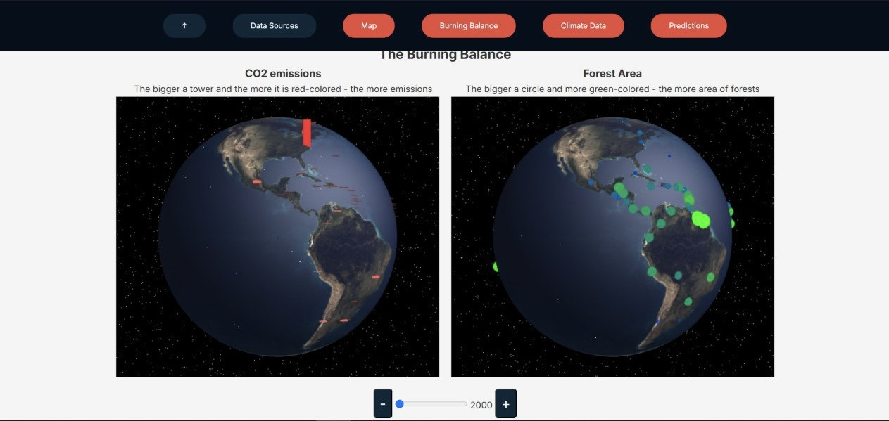
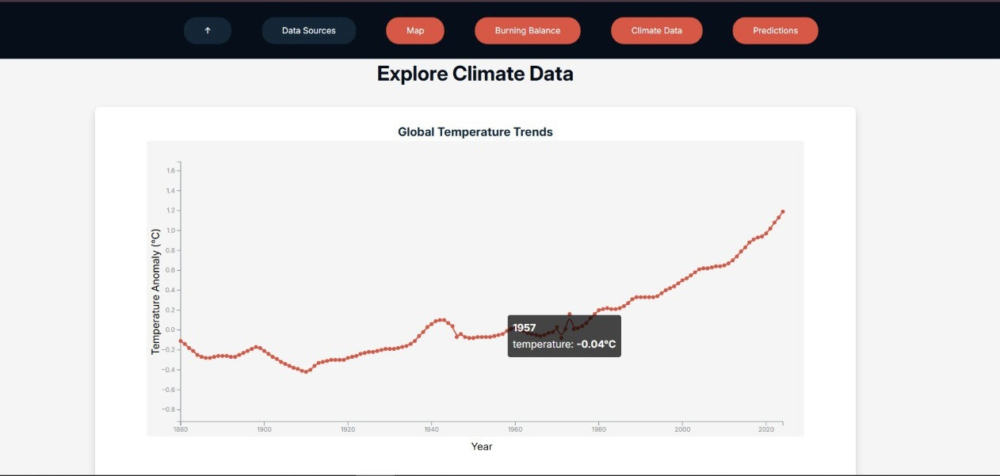
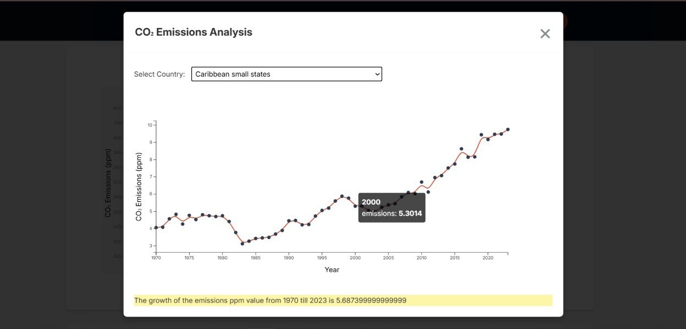

# Global Climate Change Insights: An Interactive Visualization of Environmental Data

## Repository Structure
See the structure [here](./checkpoints/repository_structure.md)

## Run the app
To tun the app you can simple clone our repository and run ``docker-compose up --build`` from the root directory. After containers are ready the page is available on the ``localhost:8080``.

## Visualizations

### Heatmap shows CO2 emissions by countries

### Interactive globes with CO2 and forests data

### Graph illustrating temperature trends spanning more than 140 years

### CO2 emissions graph with available counrty/region selection

### Correlations of different metrics

### Graph featuring options to select regions and metrics

### Renewable energy top

## Project Description

### Goal  
The goal of this project is to create an interactive web application that visualizes global climate change data, enabling users to explore trends, correlations, and impacts of environmental factors such as temperature, carbon emissions, and natural disasters over time.

### Vision  
The application will tell the story of how climate change has evolved globally, highlighting key trends and anomalies. It will help users understand the relationship between human activities (e.g., CO2 emissions) and environmental changes (e.g., rising temperatures, melting ice caps).

### Target Audience  
- **General Public:** To raise awareness about climate change.  
- **Researchers and Students:** To explore and analyze climate data.  
- **Policy Makers:** To understand trends and make data-driven decisions.  

### Key Questions for Users  
1. How have global temperatures changed over the past century?  
2. What is the correlation between CO2 emissions and temperature rise?  
3. How have natural disasters (e.g., wildfires, hurricanes) increased over time?  
4. Which countries contribute the most to global emissions?  

---

## Dataset Description

### Data Sources  
- **Primary Sources:**  
  - **NASA:** Historical temperature records, CO2 levels, and sea level rise.  
  - **World Bank Open Data:** Country-specific emissions and economic indicators.  

### Dataset Overview  
- **Variables:** Temperature anomalies, CO2 levels, sea level rise, natural disaster frequency, country-specific emissions, GDP.  
- **Time Period:** 1900–2023.  
- **Geographic Coverage:** Global (country-level granularity where possible).  
- **Size:** ~10,000–20,000 records after preprocessing.  

---

## Visualization Layout

### Architecture  
1. **Data Pipeline:**  
   - **Scraping:** Collect data using Scrapy (NASA, NOAA, World Bank).  
   - **Cleaning/Preprocessing:** Pandas for handling missing values and restructuring.  
   - **Exploration:** Matplotlib for EDA.  
   - **Delivery:** Flask API to serve processed JSON data.  
   - **Visualization:** Interactive panels built with Three.js and D3.js.  

### Interactive Features  
- **Interactive Charts:** Points hovering allows to see more detailed information.
- **Filtering:** By year, region, or variable.  
- **Animations:** Smooth transitions during updates.  
