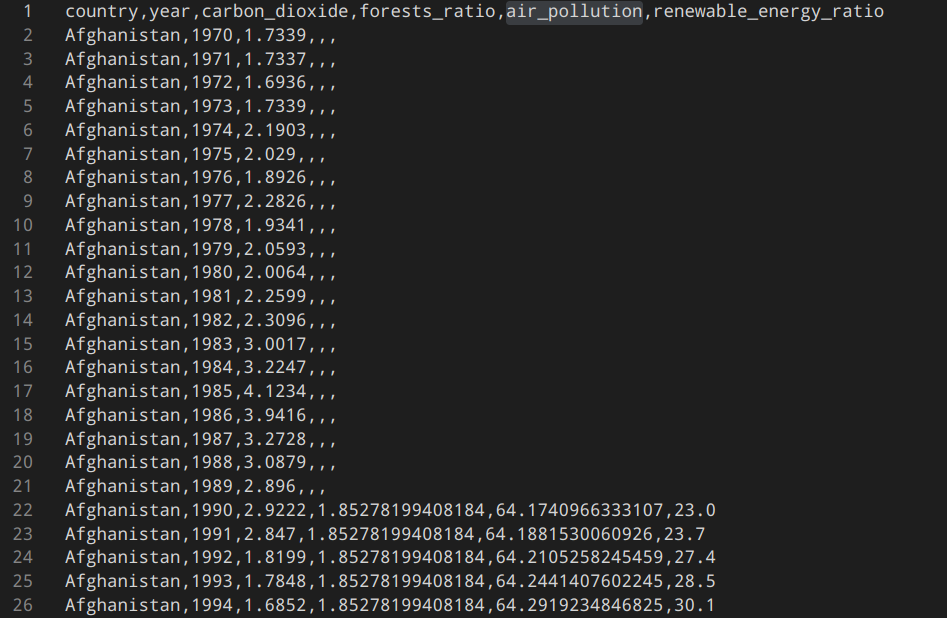
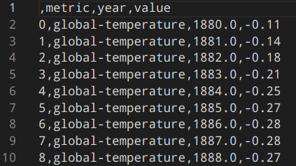

# Checkpoint 1

## What we have done?
1. We finished the Data Collection phase. We used Scrapy library for scraping (you can see spiders in the data_collection/ folder), and extracted data from the NASA and WorldBank websites. We collected data in the JSON format initially.

WorldBank CSV:

NASA CSV:

However, we think we will use JSON file for the NASA data, because it will be more convenient to get data for the distinct fields (global-temperaure or co2 emissions for example)

2. We explored the collected data. You can find our EDA python notebooks in the data_exploration/ folder. We identified correlations, missing values, data shapes and behaviour over the years. We decided not to get rid of NaN values in the WorldBank data, becasue we found a pattern: several countries' measurements are absent because of a late measurements beginning. Scientists started to collect the 'air_pollution' metric only in the end of the 20th century, or the data isn't collected yet (some data is absent for the last 4 years). We also found the baselines for our visualizations: the trends of growing global temperature and CO2 emissions are clear, and we have to visualize it in the interactive maner (see the 3rd point about our visualizations).

3.  We decided to visualize our app like this:

# Website Layout

| Section        | Description                                                                                           |
|----------------|-----------------------------------------------------------------------------------------------------------------------|
| **Header**     | The top section of the website with our topic       |
| **Navigation** | A button to Scroll Up and data sources                                    |
| **Main Content**| A short description of the project's goals and the problem + picture of the forest in the background|
| **Visualizations**    | A section with rectangles. Click on a rectangle -> open the **plot** with filtering options              |
| **3D Globe**    | Scrolling the window down we should see the 3D globe which is covered with world countries map. Each country should be colored with different shades depending on how many CO2 emissions it produces. Hovering them we can see the exact value.              |
| **Footer**     | The bottom section with our github repository, names and contact information. Probably the HTML form will be added to collect users' feedback           |

**Plots** that we are planning:
After the EDA phase we can determine what exactly plots we would like to see on our application:
- The Temperature Warming plots: 1st plot - linechart with average global temperature growth, 2nd plot - linechart for a distinct country (option to choose a country)
- COe emissions plots: the same scheme + shadowed kde plot of CO2 intercecting with shadowed kde plot of global temperature (they will intersect a lot to demonstred the correlation) 
- Global Statictics: the plot with ALL available metrics from both datasets per each country. The user must choose the country first, and then the plot will show him all metrics for the chosen country (yearly temperature, air pollution, percent of forests, etc.). + short summary (the co2 grows, air pollution grows, etc.) compute it after the plot generation
- Renewable Energy plots to see top countries: bar chart showing top 10 countries by renewable energy usage over the past 10 years. The user also can switch to the worst countries in this field, or check the value (average over last 10 year) of renewable energy ratio in his country.

The template for our web app: https://ru.wix.com/website-template/view/html/2948?originUrl=https%3A%2F%2Fru.wix.com%2Fwebsite%2Ftemplates&tpClick=view_button&esi=d88b71f0-cd5b-4cdf-b4fc-bd3279ba576a