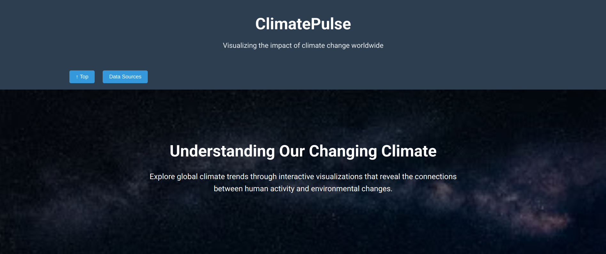
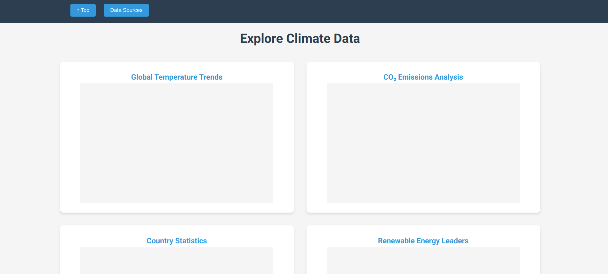
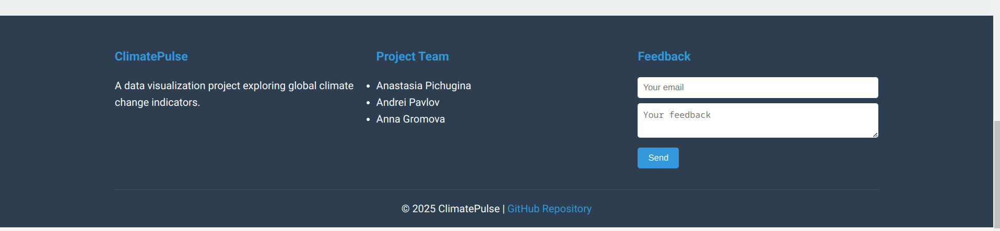
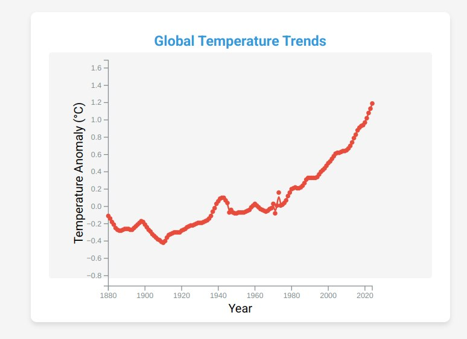
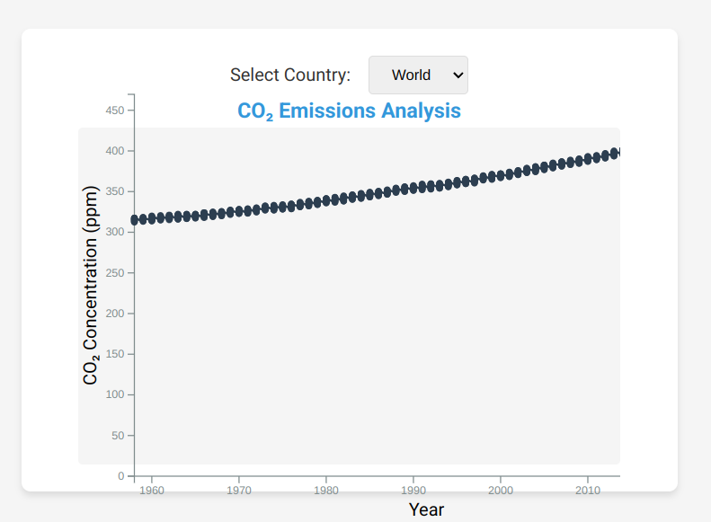
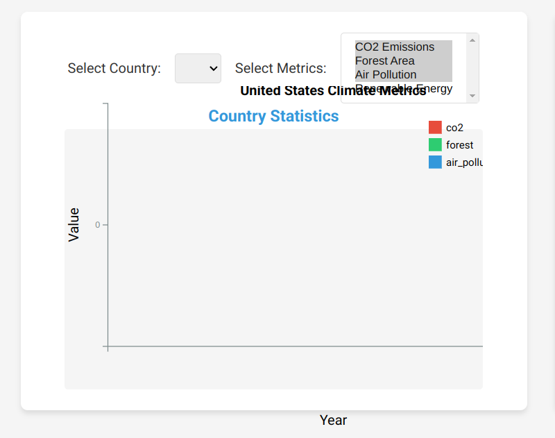
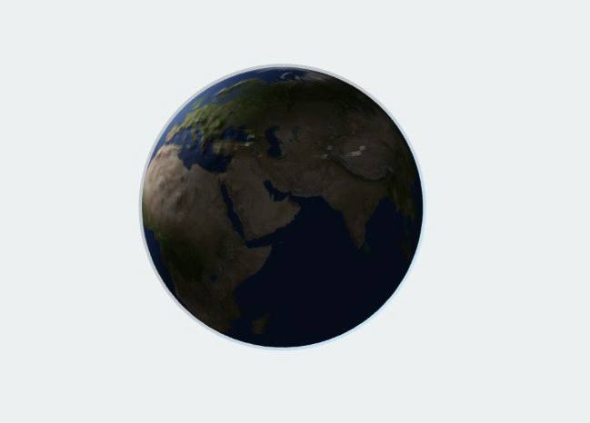

# Checkpoint 2

## Run the app
To tun the app you can simple clone our repository and run ``docker-compose up --build`` from the root directory. After containers are ready the page is available on the ``localhost:8080``.

## Backend

We have implemented the backend part for our project. It is written in Flask and uses the helper class from data_loader.py. The following endpoints are present on our server:
- **/api/metrics:** gives a map of metrics {'our simple metric name':'hardcoded WorldBank metric names'}.
- **/api/nasa:** gives a raw NASA data ({'metric' : {'year' : 'value', ...}, ...})
- **/api/nasa/<metric_key>:** gives 2 lists [years] and [corresponding values] from NASA (global measurements) for requested metric.
- **/api/countries:** gives a list of available countries for the WorldBank data.
- **/api/wb/metric:** gives 2 lists [ years ] and [corresponding values] for requested country and metric from WorldBank.
    - WorldBank has complex structure. For our purposes we need to get data rapidly: 1) about required country with and without required metric; 2) about required metric with and without required country. This endpoints gives data for the 2nd case.
- **/api/wb/country:** this enpoint gives data for the 1st case (see previos point).
- **/api/top/<metric_key>:** gives top countries based on metric (e.g. top countries by using renewable resources).
- **/api/country/<country_name>/metrics:** get all available information about country (temperature and CO2 emissions from global data + local country data)

## Frontend

Then, we wrote a 'template' for our website:

Right now we are working on the main part: visualizations. We have created the 1st plot and made it to look as we want:

Also we have these chart that are a little bit messy and require the further adjustments (they will look alike the temperature chart):

For the globe we have the following template:

